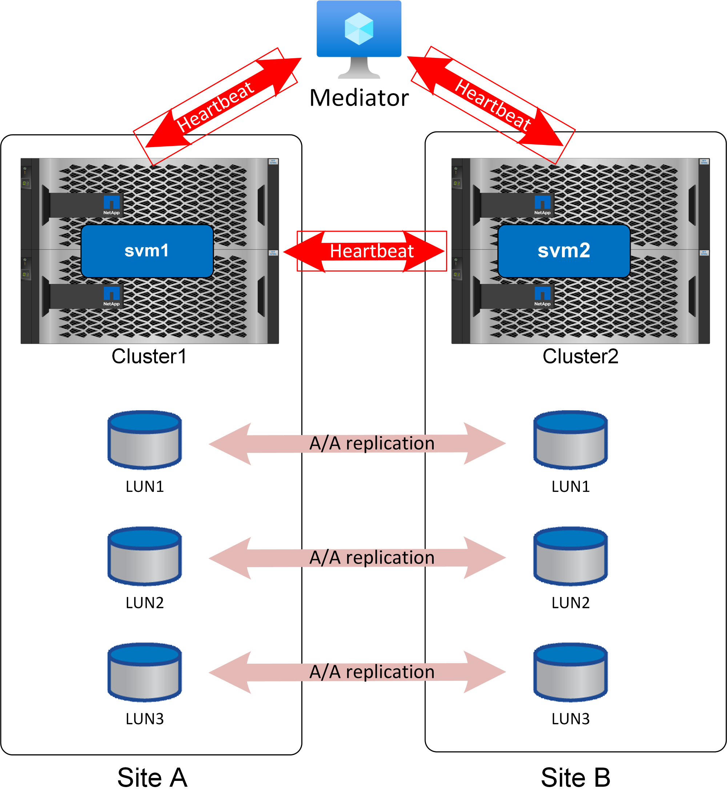

= 
:allow-uri-read: 

Der Mediator ist nicht wirklich ein Tiebreak, obwohl das ist effektiv die Funktion, die es bietet. Er führt keine Aktionen durch. Stattdessen stellt er einen alternativen Kommunikationskanal für die Kommunikation zwischen Cluster und Cluster bereit.

Die #1 Herausforderung mit automatisiertem Failover ist das Split-Brain-Problem, und dieses Problem tritt auf, wenn Ihre zwei Standorte die Verbindung miteinander verlieren. Was soll geschehen? Sie möchten nicht, dass sich zwei verschiedene Standorte als verbleibende Kopien der Daten bezeichnen, aber wie kann ein einzelner Standort den Unterschied zwischen dem tatsächlichen Verlust des anderen Standorts und der Unfähigkeit, mit dem gegenüberliegenden Standort zu kommunizieren, erkennen?

Hier betritt der Mediator das Bild. Wenn jeder Standort an einem dritten Standort platziert wird und über eine separate Netzwerkverbindung zu diesem Standort verfügt, haben Sie für jeden Standort einen zusätzlichen Pfad, um den Zustand des anderen zu überprüfen. Sehen Sie sich das Bild oben noch einmal an und betrachten Sie die folgenden Szenarien.

* Was passiert, wenn der Mediator ausfällt oder von einem oder beiden Standorten nicht erreichbar ist?
+
** Die beiden Cluster können weiterhin über dieselbe Verbindung miteinander kommunizieren, die für Replikationsdienste verwendet wird.
** Für die Daten wird noch eine RPO=0-Sicherung verwendet

* Was passiert, wenn Standort A ausfällt?
+
** An Standort B sehen Sie, dass beide Kommunikationskanäle ausgefallen sind.
** Standort B übernimmt die Datenservices, jedoch ohne RPO=0-Spiegelung

* Was passiert, wenn Standort B ausfällt?
+
** An Standort A sehen Sie, dass beide Kommunikationskanäle ausgefallen sind.
** Standort A übernimmt die Datenservices, aber ohne RPO=0-Spiegelung

Es gibt ein anderes Szenario zu berücksichtigen: Verlust der Datenreplikationsverbindung. Wenn die Replikationsverbindung zwischen Standorten verloren geht, wird eine RPO=0-Spiegelung offensichtlich unmöglich sein. Was soll dann geschehen?

Dies wird durch den bevorzugten Standortstatus gesteuert. In einer SM-AS-Beziehung ist einer der Standorte zweitrangig zum anderen. Dies hat keine Auswirkungen auf den normalen Betrieb, und der gesamte Datenzugriff ist symmetrisch. Wenn die Replikation jedoch unterbrochen wird, muss die Verbindung unterbrochen werden, um den Betrieb wieder aufzunehmen. Das Ergebnis: Der bevorzugte Standort setzt den Betrieb ohne Spiegelung fort und der sekundäre Standort hält die I/O-Verarbeitung an, bis die Replizierungskommunikation wiederhergestellt ist.
