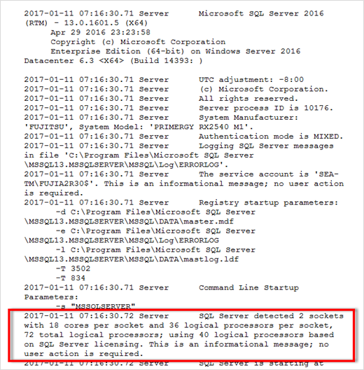

= CPU-Konfiguration
:allow-uri-read: 
:firstname: [.lead]
:author: [.lead]
:authorinitials: [
:authors: [.lead]
:revdate: Modifying server and database settings can help achieve better and more efficient database performance.

== Hyperthreading

Hyperthreading ist Intels proprietäre Implementierung für simultanes Multithreading (SMT), die die Parallelisierung von Berechnungen (Multitasking) auf x86-Mikroprozessoren verbessert.

Hardware, die Hyperthreading verwendet, ermöglicht die Darstellung der logischen hyperthread-CPUs als physische CPUs für das Betriebssystem. SQL Server erkennt dann die physischen CPUs, die das Betriebssystem darstellt, und kann so die Hyper-Threading-Prozessoren verwenden.

Der Nachteil hierbei ist, dass jede SQL Server-Version ihre eigenen Einschränkungen hinsichtlich der Rechenleistung hat, die sie verwenden kann. Weitere Informationen finden Sie unter Kapazitätsgrenzen nach Edition von SQL Server berechnen.

Bei der Lizenzierung von SQL Server gibt es zwei wichtige Denkschulen. Die erste wird als Server + Client Access License (CAL)-Modell bezeichnet; die zweite ist das pro Prozessor-Core-Modell. Obwohl Sie mit der Server + CAL-Strategie auf alle in SQL Server verfügbaren Produktfunktionen zugreifen können, gibt es eine Hardwaregrenze von 20 CPU-Kernen pro Sockel. Selbst wenn Sie SQL Server Enterprise Edition + CAL für einen Server mit mehr als 20 CPU-Kernen pro Socket verwenden, kann die Anwendung nicht alle diese Kerne gleichzeitig auf dieser Instanz verwenden. Abbildung zeigt die SQL Server-Protokollmeldung nach dem Start, die die Durchsetzung des Kernlimits anzeigt.

=== Protokolleinträge geben an, wie viele Kerne nach dem Start von SQL Server verwendet werden.

Um alle CPUs zu verwenden, sollten Sie daher die Prozessorkern-Lizenz verwenden. Weitere Informationen zur SQL Server-Lizenzierung finden Sie unter link:https://www.microsoft.com/en-us/sql-server/sql-server-2022-comparison["SQL Server 2022: Ihre moderne Datenplattform"^].

== CPU-Affinität

Es ist unwahrscheinlich, dass Sie jemals die Standardeinstellungen für die Prozessoraffinität ändern müssen, es sei denn, Sie stoßen auf Leistungsprobleme, aber es lohnt sich immer noch zu verstehen, was sie sind und wie sie funktionieren.

SQL Server unterstützt die Prozessoraffinität durch zwei Optionen:

* CPU-Affinitätsmaske
* Affinity-E/A-Maske

SQL Server verwendet alle CPUs, die über das Betriebssystem verfügbar sind (wenn die Prozessorkern-Lizenz gewählt wird). Es erstellt Scheduler auf allen CPUs, um die Ressourcen für jeden gegebenen Workload optimal zu nutzen. Beim Multitasking kann das Betriebssystem oder andere Anwendungen auf dem Server die Prozess-Threads von einem Prozessor zum anderen wechseln. SQL Server ist eine ressourcenintensive Applikation und daher kann die Performance in diesem Fall beeinträchtigt werden. Um den Effekt zu minimieren, können Sie die Prozessoren so konfigurieren, dass die gesamte SQL Server-Last an eine vorgewählte Prozessorgruppe weitergeleitet wird. Dies wird durch die CPU Affinitätsmaske erreicht.

Die Affinity I/O-Maskenoption bindet SQL Server-Festplatten-I/O an eine Teilmenge von CPUs. In SQL Server-OLTP-Umgebungen kann diese Erweiterung die Performance von SQL Server-Threads steigern, die I/O-Vorgänge ausgeben.

== Max. Parallelitätsgrad (MAXDOP)

Standardmäßig verwendet SQL Server während der Abfrageausführung alle verfügbaren CPUs (wenn die Prozessorkernlizenz gewählt wurde).

Obwohl dies ideal für große Abfragen ist, kann es zu Leistungsproblemen und zur Begrenzung der Parallelität kommen. Ein besserer Ansatz besteht darin, die Parallelität auf die Anzahl der physischen Kerne in einem einzelnen CPU-Socket zu beschränken. Beispiel: Auf einem Server mit zwei physischen CPU-Sockeln mit 12 Kernen pro Socket, unabhängig von Hyperthreading, sollte MAXDOP auf 12 gesetzt werden. MAXDOP kann nicht festlegen, welche CPU verwendet werden soll. Stattdessen beschränkt es die Anzahl der CPUs, die von einer einzelnen Batch-Abfrage verwendet werden können.

TIP: *NetApp empfiehlt* für DSS wie Data Warehouses, beginnen Sie mit dieser Einstellung bei 50 oder so und stimmen Sie ggf. auf oder ab. Stellen Sie sicher, dass Sie die kritischen Abfragen in Ihrer Anwendung messen und gegebenenfalls anpassen.

== Max. Worker-Threads

Die Option Max. Worker-Threads hilft, die Leistung zu optimieren, wenn eine große Anzahl von Clients mit SQL Server verbunden ist.

Normalerweise wird für jede Abfrageanforderung ein separater Betriebssystemthread erstellt. Wenn Hunderte von gleichzeitigen Verbindungen zu SQL Server hergestellt werden, verbraucht ein Thread pro Abfrage große Mengen an Systemressourcen. Die Option Max Worker Threads verbessert die Leistung, indem SQL Server in die Lage versetzt wird, einen Pool von Worker-Threads zu erstellen, um eine größere Anzahl von Abfrage-Anforderungen zu bedienen.

Der Standardwert ist 0, wodurch SQL Server die Anzahl der Worker-Threads beim Start automatisch konfigurieren kann. Dies funktioniert für die meisten Systeme. Max Worker-Threads sind eine erweiterte Option und sollten nicht ohne Unterstützung durch einen erfahrenen Datenbankadministrator (DBA) geändert werden.

Wann sollten Sie SQL Server so konfigurieren, dass mehr Worker-Threads verwendet werden? Wenn die durchschnittliche Länge der Arbeitswarteschlange für jeden Scheduler über 1 liegt, können Sie vom Hinzufügen weiterer Threads zum System profitieren, jedoch nur, wenn die Last nicht CPU-gebunden ist oder andere schwere Wartezeiten auftritt. Wenn einer dieser Vorgänge stattfindet, sind weitere Threads nicht hilfreich, da sie schließlich auf andere Systemengpässe warten müssen. Weitere Informationen zu max. Worker-Threads finden Sie unter link:https://learn.microsoft.com/en-us/sql/database-engine/configure-windows/configure-the-max-worker-threads-server-configuration-option?view=sql-server-ver16&redirectedfrom=MSDN["Konfigurieren Sie die Option Max Worker Threads Server Configuration"^].

image:./media/max-worker-threads.png["Fehler: Fehlendes Grafikbild"]

=== Konfigurieren von max Worker-Threads mit SQL Server Management Studio

....
The following example shows how to configure the max work threads option using T-SQL.

EXEC sp_configure 'show advanced options', 1;

GO

RECONFIGURE ;

GO

EXEC sp_configure 'max worker threads', 900 ;

GO

RECONFIGURE;

GO
....