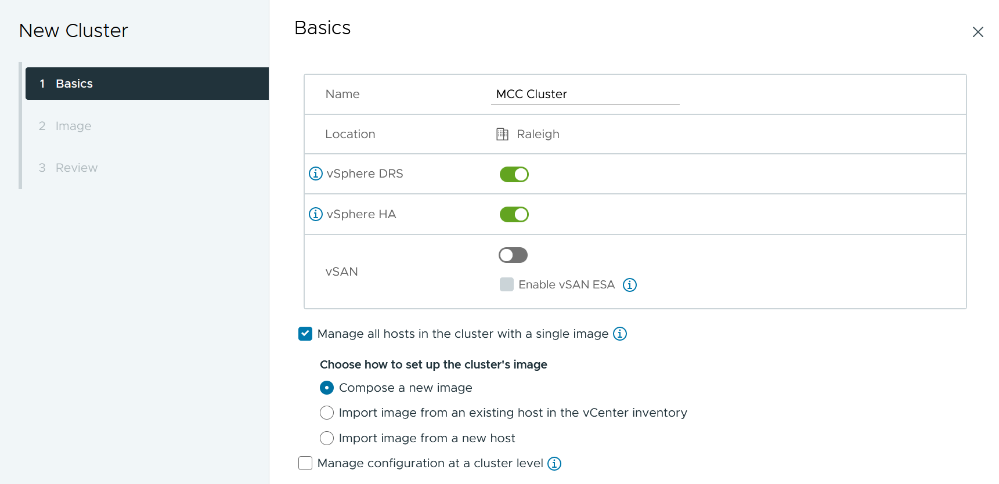

= VMSC Design- und Implementierungsrichtlinien
:hardbreaks:
:allow-uri-read: 
:nofooter: 
:icons: font
:linkattrs: 
:imagesdir: ../media/

[role="lead"]
Dieses Dokument enthält Design- und Implementierungsrichtlinien für vMSC mit ONTAP Storage-Systemen.

== NetApp-Speicherkonfiguration

Setup-Anweisungen für NetApp MetroCluster (MCC-Konfiguration) finden Sie unter https://docs.netapp.com/us-en/ontap-metrocluster/["MetroCluster-Dokumentation"]. Anweisungen für SnapMirror Active Sync (SMAS) finden Sie auch unter https://docs.netapp.com/us-en/ontap/smbc/index.html["Überblick über die Business Continuity in SnapMirror"].

Sobald Sie MetroCluster konfiguriert haben, ist die Verwaltung wie das Management einer herkömmlichen ONTAP-Umgebung. Sie können Storage Virtual Machines (SVMs) mithilfe verschiedener Tools wie Command Line Interface (CLI), System Manager oder Ansible einrichten. Sobald die SVMs konfiguriert sind, erstellen Sie logische Schnittstellen (LIFs), Volumes und LUNs (Logical Unit Numbers) auf dem Cluster, die für den normalen Betrieb verwendet werden. Diese Objekte werden automatisch über das Cluster-Peering-Netzwerk auf den anderen Cluster repliziert.

Wenn Sie MetroCluster nicht nutzen, können Sie SnapMirror Active Sync verwenden, was Datastores-granulare Sicherung und aktiv/aktiv-Zugriff über diverse ONTAP Cluster in verschiedenen Ausfall-Domains hinweg bietet. SMAS verwendet Konsistenzgruppen (CGS), um die Konsistenz der Schreibreihenfolge zwischen einem oder mehreren Datastores sicherzustellen. Je nach Applikations- und Datastore-Anforderungen können Sie mehrere CGS erstellen. Konsistenzgruppen sind insbesondere für Applikationen nützlich, die eine Datensynchronisierung zwischen mehreren Datastores erfordern. SMAS unterstützt auch Raw Device Mapping (RDMs) und über das Gastsystem verbundenen Storage mit in-Guest-iSCSI-Initiatoren. Weitere Informationen zu Konsistenzgruppen finden Sie unter https://docs.netapp.com/us-en/ontap/consistency-groups/index.html["Übersicht über Konsistenzgruppen"].

ONTAP-Tools bieten jetzt eine einfache Möglichkeit, SnapMirror Active Sync für vMSC zu konfigurieren. Mit dem ONTAP Tools vCenter Plug-in können Sie aktive SnapMirror Synchronisierungsbeziehungen zwischen zwei ONTAP Clustern erstellen und managen. Das Plug-in bietet eine einfache und intuitive Benutzeroberfläche zum Erstellen und Managen von aktiven SnapMirror Synchronisierungsbeziehungen zwischen zwei ONTAP Clustern. Sie können mehr über die ONTAP Tools vCenter Plugin unter erfahren https://docs.netapp.com/us-en/ontap-tools-vmware-vsphere-10/index.html["ONTAP Tools für VMware vSphere"], oder direkt in springen https://docs.netapp.com/us-en/ontap-tools-vmware-vsphere-10/configure/protect-cluster.html["Schützen mit Host-Cluster-Schutz"].

Es gibt einen Unterschied beim Management einer vMSC Konfiguration mit aktiver SnapMirror Synchronisierung im Vergleich zu einer MetroCluster. Zunächst einmal ist SMAS eine reine SAN-Konfiguration. Es können keine NFS-Datastores mit aktiver SnapMirror-Synchronisierung gesichert werden. Als zweites müssen Sie Ihren ESXi-Hosts beide Kopien der LUNs zuordnen, damit sie auf die replizierten Datastores in beiden Ausfall-Domains zugreifen können.

== VMware vSphere Konfiguration

=== Erstellen Sie einen vSphere HA-Cluster

Die Erstellung eines vSphere HA-Clusters ist ein mehrstufiger Prozess, der in vollständig dokumentiert ist https://docs.vmware.com/en/VMware-vSphere/8.0/vsphere-vcenter-esxi-management/GUID-F7818000-26E3-4E2A-93D2-FCDCE7114508.html["Wie erstellen und konfigurieren Sie Cluster im vSphere Client auf docs.vmware.com"]. Kurz gesagt: Sie müssen zuerst einen leeren Cluster erstellen, dann mit vCenter Hosts hinzufügen und vSphere HA und andere Einstellungen des Clusters angeben.

NOTE: Nichts in diesem Dokument ersetzt https://www.vmware.com/docs/vmw-vmware-vsphere-metro-storage-cluster-recommended-practices["Empfohlene Practices für VMware vSphere Metro Storage-Cluster"]. Dieser Inhalt dient zur einfachen Referenz und stellt keinen Ersatz für die offizielle VMware Dokumentation dar.

Führen Sie zum Konfigurieren eines HA-Clusters die folgenden Schritte aus:

. Stellen Sie eine Verbindung zur vCenter-Benutzeroberfläche her.
. Navigieren Sie unter Hosts und Cluster zum Rechenzentrum, in dem Sie Ihr HA-Cluster erstellen möchten.
. Klicken Sie mit der rechten Maustaste auf das Datacenter-Objekt, und wählen Sie Neuer Cluster aus. Unter Grundlagen stellen Sie sicher, dass Sie vSphere DRS und vSphere HA aktiviert haben. Schließen Sie den Assistenten ab.

. Wählen Sie den Cluster aus, und wechseln Sie zur Registerkarte Konfigurieren. Wählen Sie vSphere HA aus, und klicken Sie auf Bearbeiten.
. Wählen Sie unter Host-Überwachung die Option Host-Überwachung aktivieren aus.

image::../media/vmsc_3_2.png[Aktivieren der Host-Überwachungsoption,624,475]

. Wählen Sie auf der Registerkarte „Fehler und Antworten“ unter „VM-Überwachung“ die Option „nur VM-Überwachung“ oder „VM- und Anwendungsüberwachung“ aus.

image::../media/vmsc_3_3.png[VM-Monitoring,624,480]

. Legen Sie unter Admission Control die Option HA-Eintrittskontrolle auf Cluster-Ressourcenreserve fest. Verwenden Sie 50 % CPU/MEM.

image::../media/vmsc_3_4.png[Zugangskontrolle,624,479]

. Klicken Sie auf „OK“.
. Wählen Sie DRS und klicken Sie auf BEARBEITEN.
. Setzen Sie den Automatisierungsgrad auf manuell, sofern dies nicht von Ihren Anwendungen erforderlich ist.

image::../media/vmsc_3_5.png[Vmsc 3 5,624,336]

. Aktivieren Sie den Schutz von VM-Komponenten, siehe https://docs.vmware.com/en/VMware-vSphere/8.0/vsphere-availability/GUID-F01F7EB8-FF9D-45E2-A093-5F56A788D027.html["docs.vmware.com"].
. Die folgenden zusätzlichen vSphere HA-Einstellungen werden für vMSC mit MCC empfohlen:

[cols="50%,50%"]
|===
| Ausfall | Antwort 

| Host-Ausfall | Starten Sie die VMs neu 

| Host-Isolierung | Deaktiviert 

| Datenspeicher mit Permanent Device Loss (PDL) | Schalten Sie die VMs aus und starten Sie sie neu 

| Datastore mit All Paths Down (APD) | Schalten Sie die VMs aus und starten Sie sie neu 

| Der Gast ist nicht herzschlagend | Setzt die VMs zurück 

| Richtlinie für den Neustart der VM | Bestimmt durch die Bedeutung der VM 

| Antwort für Host-Isolation | Fahren Sie die VMs herunter, und starten Sie sie neu 

| Antwort für Datastore mit PDL | Schalten Sie die VMs aus und starten Sie sie neu 

| Antwort für Datenspeicher mit APD | VMs ausschalten und neu starten (konservativ) 

| Verzögerung bei VM-Failover für APD | 3 Minuten 

| Antwort für APD-Wiederherstellung mit APD-Timeout | Deaktiviert 

| Sensitivität für VM-Monitoring | Voreinstellung hoch 
|===

=== Konfigurieren Sie Datastores für Heartbeating

VSphere HA verwendet Datastores, um Hosts und virtuelle Maschinen zu überwachen, wenn das Managementnetzwerk ausgefallen ist. Sie können konfigurieren, wie vCenter Heartbeat-Datenspeicher auswählt. Gehen Sie wie folgt vor, um Datastores für Heartbeating zu konfigurieren:

. Wählen Sie im Abschnitt Datastore Heartbeating die Option Datastores aus der angegebenen Liste verwenden aus und ergänzen Sie bei Bedarf automatisch.
. Wählen Sie die Datastores aus, die vCenter von beiden Standorten verwenden soll, und drücken Sie OK.

image::../media/vmsc_3_6.png[Ein Screenshot einer Computerbeschreibung wird automatisch generiert,624,540]

=== Konfigurieren Sie Die Erweiterten Optionen

Isolierungsereignisse treten auf, wenn Hosts innerhalb eines HA-Clusters die Verbindung zum Netzwerk oder zu anderen Hosts im Cluster verlieren. Standardmäßig verwendet vSphere HA das Standard-Gateway für sein Managementnetzwerk als Standard-Isolationsadresse. Sie können jedoch zusätzliche Isolationsadressen für den Host angeben, um zu bestimmen, ob eine Isolationsantwort ausgelöst werden soll. Fügen Sie zwei isolierte IPs hinzu, die Ping-Daten senden können, eine pro Standort. Verwenden Sie nicht die Gateway-IP. Die erweiterte vSphere HA-Einstellung ist das.isolationaddress. Dazu können Sie ONTAP- oder Mediator-IP-Adressen verwenden.

Weitere Informationen finden Sie unter https://www.vmware.com/docs/vmw-vmware-vsphere-metro-storage-cluster-recommended-practices["Empfohlene Practices für VMware vSphere Metro Storage-Cluster"]_.__

image::../media/vmsc_3_7.png[Ein Screenshot einer Computerbeschreibung wird automatisch generiert,624,545]

Das Hinzufügen einer erweiterten Einstellung namens das.heartbeatDsPerHost kann die Anzahl der Heartbeat-Datenspeicher erhöhen. Verwenden Sie vier Heartbeat Datastores (HB DSS) – zwei pro Standort. Verwenden Sie die Option „aus Liste auswählen, aber Kompliment“. Dies wird benötigt, da Sie bei Ausfall eines Standorts immer noch zwei HB DSS benötigen. Diese müssen jedoch nicht durch MCC oder SnapMirror Active Sync geschützt werden.

Weitere Informationen finden Sie unter https://www.vmware.com/docs/vmw-vmware-vsphere-metro-storage-cluster-recommended-practices["Empfohlene Practices für VMware vSphere Metro Storage-Cluster"]_.__

VMware DRS Affinity zu NetApp MetroCluster

In diesem Abschnitt erstellen wir DRS Gruppen für VMs und Hosts für jeden Standort\Cluster in der MetroCluster Umgebung. Anschließend konfigurieren wir VM\Host-Regeln, um die VM Host-Affinität mit lokalen Storage-Ressourcen auszurichten. Beispielsweise gehören Standort A VMs zur VM-Gruppe sitea_vms und Standort A Hosts zur Host-Gruppe sitea_Hosts. Als nächstes geben wir in VM\Host Rules an, dass sitea_vms auf Hosts in sitea_Hosts ausgeführt werden sollen.

[TIP]
====
* NetApp empfiehlt dringend die Spezifikation *sollte auf Hosts in Gruppe* laufen anstatt der Spezifikation *muss auf Hosts in Gruppe* ausgeführt werden. Im Falle eines Host-Ausfalls von Standort A müssen die VMs von Standort A über vSphere HA auf Hosts an Standort B neu gestartet werden. Bei der letzteren Spezifikation ist jedoch nicht möglich, dass HA die VMs auf Standort B neu starten, da es die harte Regel ist. Die frühere Spezifikation ist eine weiche Regel und wird im Falle von HA verletzt, wodurch die Verfügbarkeit anstatt die Leistung ermöglicht wird.
* Sie können einen ereignisbasierten Alarm erstellen, der ausgelöst wird, wenn eine virtuelle Maschine gegen eine VM-Host-Affinitätsregel verstößt. Fügen Sie im vSphere Client einen neuen Alarm für die virtuelle Maschine hinzu und wählen Sie als Ereignisauslöser „VM verletzt VM-Host Affinity Rule“ aus. Weitere Informationen zum Erstellen und Bearbeiten von Alarmen finden Sie in link:https://techdocs.broadcom.com/us/en/vmware-cis/vsphere/vsphere/8-0/vsphere-monitoring-and-performance-8-0.html["VSphere Monitoring und Performance"^]der Dokumentation.

====

=== DRS-Host-Gruppen erstellen

So erstellen Sie DRS Host-Gruppen speziell für Standort A und Standort B:

. Klicken Sie im vSphere-Webclient mit der rechten Maustaste auf den Cluster in der Bestandsaufnahme, und wählen Sie Einstellungen aus.
. Klicken Sie auf VM\Host Groups.
. Klicken Sie Auf Hinzufügen.
. Geben Sie den Namen der Gruppe ein (z. B. sitea_Hosts).
. Wählen Sie im Menü Typ die Option Host-Gruppe aus.
. Klicken Sie auf Hinzufügen, wählen Sie die gewünschten Hosts von Standort A aus, und klicken Sie auf OK.
. Wiederholen Sie diese Schritte, um eine weitere Host-Gruppe für Standort B hinzuzufügen
. Klicken Sie auf OK.

=== DRS VM-Gruppen erstellen

So erstellen Sie DRS VM-Gruppen speziell für Standort A und Standort B:

. Klicken Sie im vSphere-Webclient mit der rechten Maustaste auf den Cluster in der Bestandsaufnahme, und wählen Sie Einstellungen aus.

. Klicken Sie auf VM\Host Groups.
. Klicken Sie Auf Hinzufügen.
. Geben Sie den Namen der Gruppe ein (z. B. sitea_vms).
. Wählen Sie im Menü Typ die Option VM-Gruppe aus.
. Klicken Sie auf Hinzufügen, wählen Sie die gewünschten VMs von Standort A aus, und klicken Sie auf OK.
. Wiederholen Sie diese Schritte, um eine weitere Host-Gruppe für Standort B hinzuzufügen
. Klicken Sie auf OK.

=== Erstellen Sie VM-Hostregeln

Gehen Sie wie folgt vor, um DRS-Affinitätsregeln für Standort A und Standort B zu erstellen:

. Klicken Sie im vSphere-Webclient mit der rechten Maustaste auf den Cluster in der Bestandsaufnahme, und wählen Sie Einstellungen aus.

. Klicken Sie auf VM\Hostregeln.
. Klicken Sie Auf Hinzufügen.
. Geben Sie den Namen der Regel ein (z. B. sitea_Affinity).
. Überprüfen Sie, ob die Option Regel aktivieren aktiviert ist.
. Wählen Sie im Menü Typ die Option Virtuelle Maschinen zu Hosts aus.
. Wählen Sie die VM-Gruppe aus (z.B. sitea_vms).
. Wählen Sie die Host-Gruppe aus (z. B. sitea_Hosts).
. Wiederholen Sie diese Schritte, um eine weitere VM\Host-Regel für Standort B hinzuzufügen
. Klicken Sie auf OK.

image::../media/vmsc_3_8.png[Ein Screenshot einer Computerbeschreibung wird automatisch generiert,474,364]

== Datastore-Cluster bei Bedarf erstellen

Führen Sie die folgenden Schritte aus, um ein Datastore-Cluster für jeden Standort zu konfigurieren:

. Navigieren Sie mithilfe des vSphere-Webclients zum Rechenzentrum, in dem sich der HA-Cluster unter Speicher befindet.
. Klicken Sie mit der rechten Maustaste auf das Datacenter-Objekt, und wählen Sie Storage > New Datastore Cluster aus.

[TIP]
====
*Bei Verwendung von ONTAP-Speicher wird empfohlen, Storage DRS zu deaktivieren.

* Storage DRS wird in der Regel nicht für die Verwendung mit ONTAP Storage-Systemen benötigt oder empfohlen.
* ONTAP bietet seine eigenen Storage-Effizienzfunktionen wie Deduplizierung, Komprimierung und Data-Compaction, die von Storage DRS beeinflusst werden können.
* Wenn Sie ONTAP-Snapshots verwenden, würde Storage vMotion die VM-Kopie im Snapshot zurücklassen, wodurch möglicherweise die Speicherauslastung erhöht wird und sich auf Backup-Anwendungen wie NetApp SnapCenter auswirken könnte, die VMs und ihre ONTAP-Snapshots nachverfolgen.

====
image::../media/vmsc_3_9.png[Storage DRS,528,94]

. Wählen Sie das HA-Cluster aus, und klicken Sie auf Weiter.

image::../media/vmsc_3_11.png[HA-Cluster,624,149]

. Wählen Sie die Datastores aus, die zu Standort A gehören, und klicken Sie auf Weiter.

image::../media/vmsc_3_12.png[Datenspeicher,624,134]

. Überprüfen Sie die Optionen, und klicken Sie auf Fertig stellen.
. Wiederholen Sie diese Schritte, um das Datastore-Cluster an Standort B zu erstellen und sicherzustellen, dass nur Datastores von Standort B ausgewählt sind.

=== VCenter Server-Verfügbarkeit

Ihre vCenter Server Appliances (VCSAs) sollten durch vCenter HA geschützt werden. Mit vCenter HA können Sie zwei VCSAs in einem aktiv/Passiv-HA-Paar implementieren. Einer in jeder Ausfall-Domäne. Weitere Informationen zu vCenter HA finden Sie im https://docs.vmware.com/en/VMware-vSphere/8.0/vsphere-availability/GUID-4A626993-A829-495C-9659-F64BA8B560BD.html["docs.vmware.com"].
