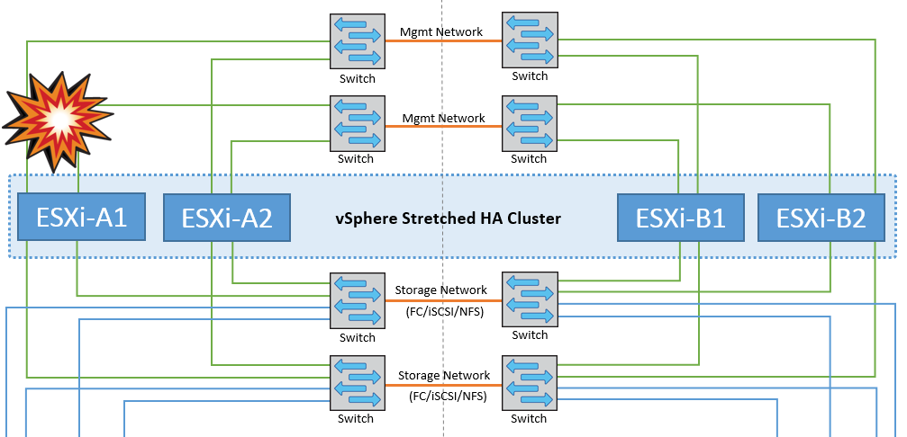
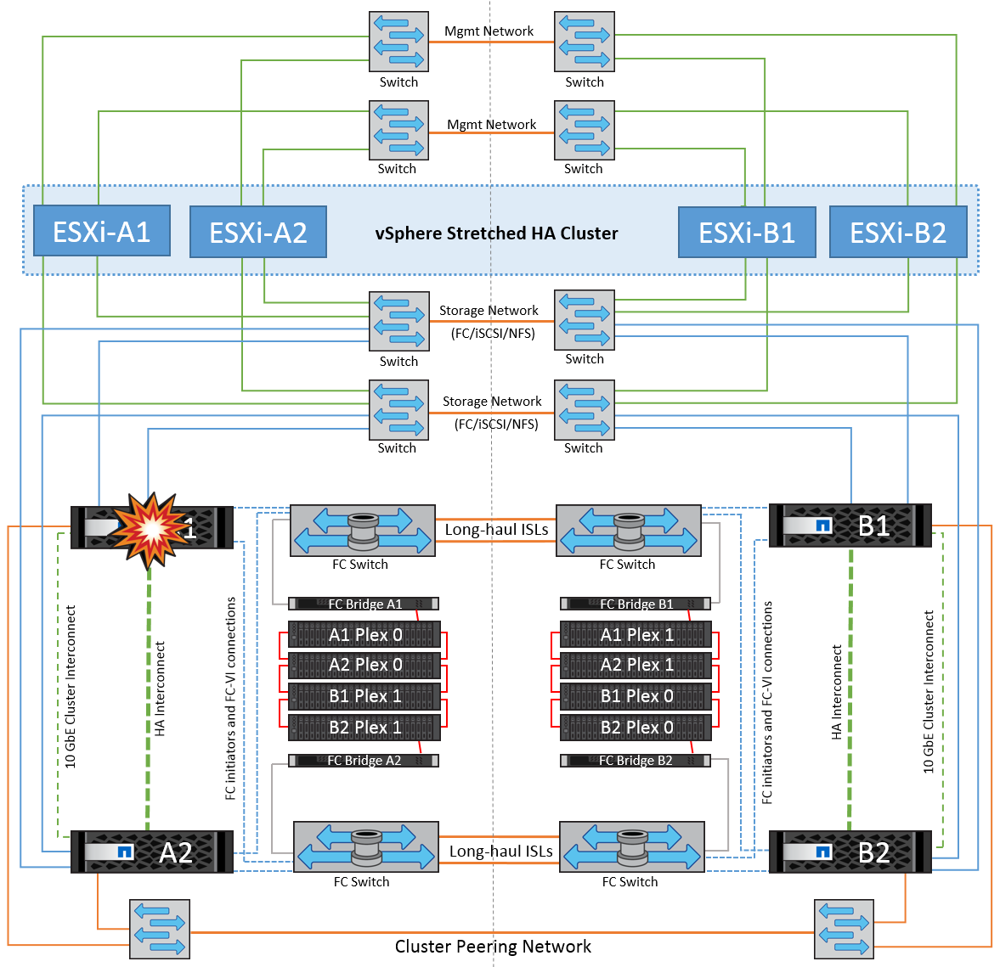
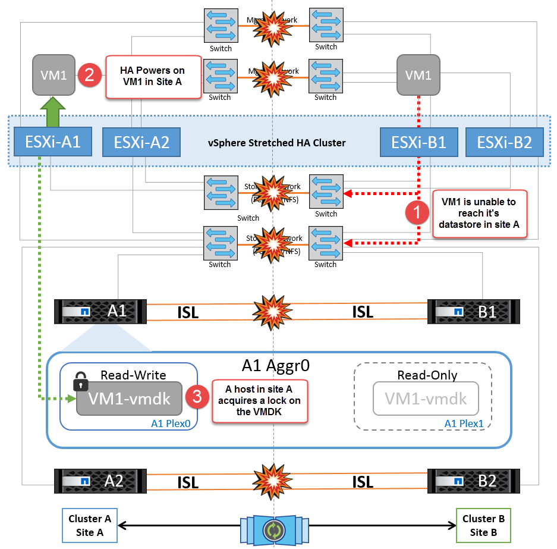
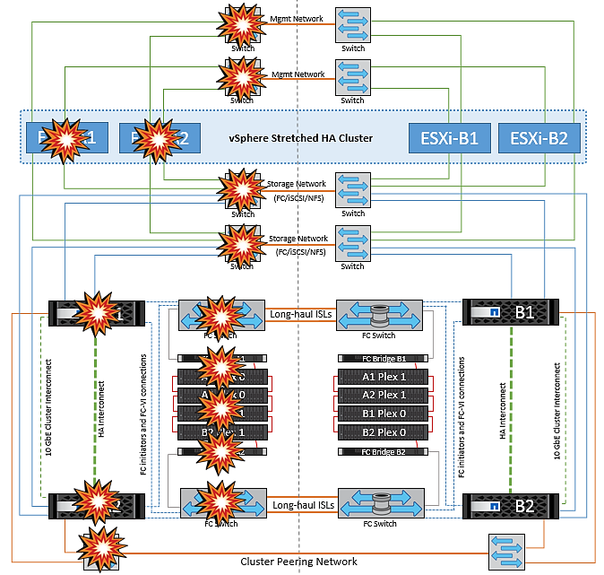

= Ausfallszenarien für vMSC mit MCC
:hardbreaks:
:allow-uri-read: 
:nofooter: 
:icons: font
:linkattrs: 
:imagesdir: ../media/

[role="lead"]
In den folgenden Abschnitten werden die erwarteten Ergebnisse verschiedener Ausfallszenarien mit vMSC- und NetApp MetroCluster-Systemen beschrieben.

== Ausfall Eines Einzelnen Storage-Pfads

Wenn in diesem Szenario Komponenten wie der HBA-Port, der Netzwerkport, der Front-End-Datenschalterport oder ein FC- oder Ethernet-Kabel ausfallen, wird dieser bestimmte Pfad zum Speichergerät vom ESXi-Host als „tot“ markiert. Wenn mehrere Pfade durch Ausfallsicherheit am HBA/Netzwerk/Switch Port für das Storage-Gerät konfiguriert sind, führt ESXi idealerweise eine Pfadumschaltung durch. Während dieser Zeit bleiben Virtual Machines ohne Beeinträchtigungen verfügbar, da für die Storage-Verfügbarkeit mehrere Pfade zum Storage-Gerät bereitgestellt werden.

*Hinweis:* Es gibt keine Änderung im MetroCluster-Verhalten in diesem Szenario, und alle Datastores bleiben weiterhin von ihren jeweiligen Seiten intakt.

=== _Best Practice_

In Umgebungen mit NFS/iSCSI-Volumes empfiehlt NetApp, mindestens zwei Netzwerk-Uplinks für den NFS-VMkernel-Port im Standard-vSwitch und dieselbe Port-Gruppe zu konfigurieren, bei der die NFS-VMkernel-Schnittstelle für den verteilten vSwitch zugeordnet ist. NIC-Teaming kann entweder aktiv-aktiv oder aktiv-Standby konfiguriert werden.

Außerdem muss bei iSCSI LUNs Multipathing konfiguriert werden, indem die VMkernel-Schnittstellen an die iSCSI-Netzwerkadapter gebunden werden. Weitere Informationen finden Sie in der vSphere-Speicherdokumentation.

=== _Best Practice_

In Umgebungen mit Fibre-Channel-LUNs empfiehlt NetApp die Verwendung von mindestens zwei HBAs, wodurch Ausfallsicherheit auf HBA-/Port-Ebene garantiert wird. NetApp empfiehlt für das Zoning von einem einzelnen Initiator außerdem als Best Practice zum Konfigurieren des Zoning.

Sie sollten mithilfe der Virtual Storage Console (VSC) Multipathing-Richtlinien festlegen, da sie Richtlinien für alle neuen und vorhandenen NetApp Storage-Geräte definiert.

== Ausfall eines einzelnen ESXi-Hosts

image::../media/vmsc_5_1.png[Ausfall eines einzelnen Hosts,624,598]

Wenn in diesem Szenario ein ESXi-Host ausfällt, erkennt der Master-Node im VMware HA-Cluster den Host-Ausfall, da er keine Netzwerk-Heartbeats mehr empfängt. Um festzustellen, ob der Host wirklich ausgefallen ist oder nur eine Netzwerkpartition ist, überwacht der Master-Knoten die Datastore-Heartbeats und führt, falls sie nicht vorhanden sind, eine abschließende Prüfung durch, indem er die Management-IP-Adressen des ausgefallenen Hosts anpingt. Wenn alle Prüfungen negativ sind, erklärt der Master-Node diesen Host als ausgefallenen Host, und alle virtuellen Maschinen, die auf diesem ausgefallenen Host ausgeführt wurden, werden auf dem noch verbleibenden Host im Cluster neu gestartet.

Wenn DRS VM und Host Affinity Regeln konfiguriert wurden (VMs in VM Gruppe sitea_vms sollten Hosts in Host Gruppe sitea_Hosts laufen lassen), dann prüft der HA Master zunächst auf verfügbare Ressourcen an Standort A. Wenn an Standort A keine verfügbaren Hosts vorhanden sind, versucht der Master, die VMs auf den Hosts an Standort B neu zu starten

Es ist möglich, dass die virtuellen Maschinen auf den ESXi-Hosts am anderen Standort gestartet werden, wenn am lokalen Standort eine Ressourcenbeschränkung vorhanden ist. Die definierten Regeln für die DRS-VM und Host-Affinität werden jedoch korrigiert, wenn Regeln verletzt werden, indem die virtuellen Maschinen zurück zu den noch verbleibenden ESXi-Hosts am lokalen Standort migriert werden. In Fällen, in denen DRS auf manuell festgelegt ist, empfiehlt NetApp, DRS zu aktivieren und die Empfehlungen anzuwenden, um die Platzierung der Virtual Machines zu korrigieren.

Es gibt keine Änderung im MetroCluster Verhalten in diesem Szenario und alle Datenspeicher bleiben von ihren jeweiligen Seiten intakt.

== ESXi-Host-Isolierung

Wenn in diesem Szenario das Managementnetzwerk des ESXi-Hosts ausgefallen ist, erhält der Master-Node im HA-Cluster keine Heartbeats, wodurch dieser Host im Netzwerk isoliert wird. Um festzustellen, ob es ausgefallen ist oder nur isoliert ist, beginnt der Master-Node mit der Überwachung des Datastore-Herzschlags. Wenn er vorhanden ist, wird der Host vom Master-Knoten isoliert deklariert. Je nach konfigurierter Isolationsantwort kann der Host sich entscheiden, die virtuellen Maschinen auszuschalten, herunterzufahren oder die virtuellen Maschinen sogar eingeschaltet zu lassen. Das Standardintervall für die Isolationsantwort beträgt 30 Sekunden.

Es gibt keine Änderung im MetroCluster Verhalten in diesem Szenario und alle Datenspeicher bleiben von ihren jeweiligen Seiten intakt.

== Platten-Shelf-Fehler

In diesem Szenario kommt es zu einem Ausfall von mehr als zwei Festplatten oder eines gesamten Shelf. Daten werden vom verbleibenden Plex ohne Unterbrechung der Datenservices bereitgestellt. Der Festplattenausfall kann sich auf einen lokalen oder einen Remote-Plex auswirken. Die Aggregate werden als degradierter Modus angezeigt, da nur ein Plex aktiv ist. Sobald die ausgefallenen Festplatten ersetzt wurden, werden die betroffenen Aggregate automatisch neu synchronisiert, um die Daten neu aufzubauen. Nach der Neusynchronisierung kehren die Aggregate automatisch in den normalen gespiegelten Modus zurück. Wenn mehr als zwei Laufwerke innerhalb einer einzelnen RAID-Gruppe ausgefallen sind, muss der Plex neu erstellt werden.

image::../media/vmsc_5_3.png[Ausfall eines einzelnen Festplatten-Shelfs:,624,576]

*Hinweis:* während dieses Zeitraums gibt es keine Auswirkungen auf die I/O-Vorgänge der virtuellen Maschine, aber die Performance ist beeinträchtigt, da die Daten vom Remote-Festplatten-Shelf über ISL-Links abgerufen werden.

== Ausfall Eines Einzelnen Storage Controllers

In diesem Szenario fällt einer der beiden Storage Controller an einem Standort aus. Da an jedem Standort ein HA-Paar vorhanden ist, wird bei einem Ausfall eines Node automatisch ein Failover auf den anderen Node ausgelöst. Wenn beispielsweise Node A1 ausfällt, werden dessen Storage und Workloads automatisch auf Node A2 übertragen. Virtuelle Maschinen sind nicht betroffen, da alle Plexe verfügbar bleiben. Die Knoten des zweiten Standorts (B1 und B2) sind davon nicht betroffen. Außerdem führt vSphere HA keine Aktion durch, da der Master-Node im Cluster weiterhin Netzwerk-Heartbeats empfängt.

Wenn der Failover Teil eines rollierenden Disaster ist (Node A1 führt ein Failover auf A2 durch) und ein nachfolgender Ausfall von A2 oder ein vollständiger Ausfall von Standort A auftritt, kann an Standort B das Umschalten nach einem Ausfall stattfinden

== Verbindungsfehler Zwischen Switches

=== Verbindungsfehler zwischen Switches im Managementnetzwerk

image::../media/vmsc_5_5.png[Verbindungsfehler zwischen Switches im Managementnetzwerk,624,184]

In diesem Szenario können die ESXi-Hosts an Standort A nicht mit ESXi-Hosts an Standort B kommunizieren, wenn die ISL-Links am Front-End-Hostverwaltungsnetzwerk fehlschlagen Dies führt zu einer Netzwerkpartition, da ESXi-Hosts an einem bestimmten Standort die Netzwerk-Heartbeats nicht an den Master-Node im HA-Cluster senden können. Daher gibt es aufgrund der Partition zwei Netzwerksegmente, und in jedem Segment gibt es einen Master-Knoten, der die VMs vor Host-Ausfällen innerhalb des jeweiligen Standorts schützt.

*Hinweis:* während dieser Zeit bleiben die virtuellen Maschinen aktiv und es gibt keine Änderung im MetroCluster-Verhalten in diesem Szenario. Alle Datenspeicher bleiben von ihren jeweiligen Seiten intakt.

=== Verbindungsfehler zwischen Switches im Speichernetzwerk

image::../media/vmsc_5_6.png[Fehler bei der Verbindung zwischen Switches im Speichernetzwerk,624,481]

Wenn in diesem Szenario die ISL-Verbindungen im Back-End-Speichernetzwerk ausfallen, verlieren die Hosts an Standort A den Zugriff auf die Speicher-Volumes oder LUNs von Cluster B an Standort B und umgekehrt. Die VMware DRS Regeln sind so definiert, dass die Host-Storage-Standortaffinität die Ausführung der Virtual Machines ohne Auswirkungen auf den Standort erleichtert.

Während dieses Zeitraums bleiben die virtuellen Maschinen an ihren jeweiligen Standorten in Betrieb und es gibt keine Änderung im MetroCluster-Verhalten in diesem Szenario. Alle Datenspeicher bleiben von ihren jeweiligen Seiten intakt.

Wenn aus irgendeinem Grund die Affinitätsregel verletzt wurde (z. B. VM1, das von Standort A ausgeführt werden sollte, wo sich seine Festplatten auf lokalen Cluster A-Knoten befinden, auf einem Host an Standort B ausgeführt wird), wird der Remote-Zugriff auf das Laufwerk der virtuellen Maschine über ISL-Links erfolgen. Aufgrund eines ISL-Verbindungsfehlers kann VM1, der an Standort B ausgeführt wird, nicht auf seine Festplatten schreiben, da die Pfade zum Storage-Volume ausgefallen sind und die jeweilige Virtual Machine nicht verfügbar ist. In diesen Situationen nimmt VMware HA keine Aktion vor, da die Hosts aktiv Heartbeats senden. Diese Virtual Machines müssen an den jeweiligen Standorten manuell ausgeschaltet und eingeschaltet werden. Die folgende Abbildung zeigt eine VM, die gegen eine DRS Affinitätsregel verstößt.

image::../media/vmsc_5_7.png[Eine VM, die gegen eine DRS Affinitätsregel verstößt, kann nach einem ISL-Ausfall nicht auf Festplatten schreiben,624,502]

=== Alle Interswitch-Fehler oder komplette Rechenzentrumspartition

In diesem Szenario sind alle ISL-Verbindungen zwischen den Standorten ausgefallen und beide Standorte voneinander isoliert. Wie bereits in früheren Szenarien erläutert, wie z. B. ISL-Fehler im Managementnetzwerk und im Speichernetzwerk, werden die virtuellen Maschinen bei einem vollständigen ISL-Ausfall nicht beeinträchtigt.

Nachdem ESXi-Hosts zwischen Standorten partitioniert wurden, prüft der vSphere HA-Agent auf Datastore-Heartbeats. An jedem Standort sind die lokalen ESXi-Hosts in der Lage, die Datastore-Heartbeats auf ihr jeweiliges Lese-/Schreibvolumen/LUN zu aktualisieren. Hosts an Standort A gehen davon aus, dass die anderen ESXi-Hosts an Standort B ausgefallen sind, da keine Netzwerk-/Datastore-Heartbeats vorhanden sind. VSphere HA an Standort A versucht, die virtuellen Maschinen von Standort B neu zu starten. Dies schlägt schließlich fehl, da der Zugriff auf die Datenspeicher von Standort B aufgrund eines Fehlers in der Storage-ISL nicht möglich ist. Eine ähnliche Situation wiederholt sich in Standort B.

image::../media/vmsc_5_8.png[Alle ISL-Fehler oder vollständige Datacenter-Partition,624,596]

NetApp empfiehlt, festzustellen, ob eine Virtual Machine gegen die DRS Regeln verstoßen hat. Alle virtuellen Maschinen, die von einem Remote-Standort aus ausgeführt werden, sind ausgefallen, da sie nicht auf den Datastore zugreifen können, und vSphere HA startet diese virtuelle Maschine am lokalen Standort neu. Nachdem die ISL-Links wieder online sind, wird die virtuelle Maschine, die am Remote-Standort ausgeführt wurde, abgebrochen, da es nicht zwei Instanzen virtueller Maschinen geben kann, die mit denselben MAC-Adressen ausgeführt werden.

=== Verbindungsfehler zwischen Switches auf beiden Fabrics in NetApp MetroCluster

In einem Szenario, in dem ein oder mehrere ISLs ausfallen, wird der Datenverkehr über die verbleibenden Links fortgesetzt. Wenn alle ISLs auf beiden Fabrics ausfallen, sodass kein Link zwischen den Standorten für die Storage- und NVRAM-Replizierung vorhanden ist, stellt jeder Controller weiterhin seine lokalen Daten bereit. Bei der Wiederherstellung eines Minimums von einer ISL wird die Resynchronisierung aller Plexe automatisch durchgeführt.

Alle Schreibvorgänge, die nach einem Ausfall aller ISLs stattfinden, werden nicht auf den anderen Standort gespiegelt. Bei einem Disaster-Switchover käme es, während sich die Konfiguration in diesem Zustand befindet, zu einem Verlust der nicht synchronisierten Daten. In diesem Fall ist ein manueller Eingriff für die Wiederherstellung nach der Umschaltung erforderlich. Wenn es wahrscheinlich ist, dass über einen längeren Zeitraum keine ISLs verfügbar sind, kann ein Administrator alle Datenservices herunterfahren, um bei Bedarf ein Switchover im Notfall zu verhindern, dass Daten verloren gehen. Die Durchführung dieser Maßnahme sollte mit der Wahrscheinlichkeit einer Katastrophe abgewogen werden, die eine Umschaltung erfordert, bevor mindestens eine ISL verfügbar wird. Wenn ISLs in einem kaskadierenden Szenario ausfallen, könnte ein Administrator alternativ eine geplante Umschaltung zu einem der Standorte auslösen, bevor alle Links fehlgeschlagen sind.

image::../media/vmsc_5_10.png[Verbindungsfehler zwischen Switches auf beiden Fabrics in NetApp MetroCluster.,624,597]

=== Verbindungsfehler Bei Peered Cluster

In einem Peering-Cluster-Link-Ausfallszenario, da die Fabric-ISLs noch aktiv sind, werden die Datenservices (Lese- und Schreibvorgänge) an beiden Standorten auf beiden Plexen fortgesetzt. Jegliche Änderungen an der Cluster-Konfiguration (beispielsweise das Hinzufügen einer neuen SVM, die Bereitstellung eines Volumes oder einer LUN in einer vorhandenen SVM) können nicht an den anderen Standort weitergegeben werden. Diese werden in den lokalen CRS-Metadaten-Volumes aufbewahrt und bei Wiederherstellung der Peering-Cluster-Verbindung automatisch auf das andere Cluster übertragen. Wenn eine erzwungene Umschaltung erforderlich ist, bevor der Peered Cluster-Link wiederhergestellt werden kann, werden ausstehende Cluster-Konfigurationsänderungen automatisch von der replizierten Remote-Kopie der Metadaten-Volumes am noch verbleibenden Standort im Rahmen der Umschaltung eingespielt.

image::../media/vmsc_5_11.png[Ein Verbindungsausfall bei einem Peered Cluster,624,303]

=== Kompletter Standortausfall

In einem kompletten Standort-A-Fehlerszenario erhalten die ESXi-Hosts an Standort B keinen Netzwerk-Heartbeat von den ESXi-Hosts an Standort A, weil sie ausgefallen sind. Der HA-Master an Standort B überprüft, ob die Datastore-Heartbeats nicht vorhanden sind, deklariert die Hosts an Standort A als fehlgeschlagen und versucht, die virtuellen Maschinen an Standort A an Standort B neu zu starten In diesem Zeitraum führt der Speicheradministrator eine Umschaltung durch, um die Dienste der ausgefallenen Nodes am noch intakten Standort wiederaufzunehmen. Dadurch werden alle Speicherservices von Standort A an Standort B wiederhergestellt Nachdem die Volumes oder LUNs an Standort A an Standort B verfügbar sind, versucht der HA-Master-Agent, die virtuellen Maschinen am Standort A an Standort B neu zu starten

Wenn der Versuch des vSphere HA Master-Agenten, eine VM neu zu starten, fehlschlägt (d. h. sie wird registriert und eingeschaltet), wird der Neustart nach einer Verzögerung erneut durchgeführt. Die Verzögerung zwischen den Neustarts kann auf maximal 30 Minuten konfiguriert werden. VSphere HA versucht diese Neustarts für eine maximale Anzahl von Versuchen (standardmäßig sechs Versuche).

*Hinweis:* der HA-Master startet die Neustartversuche erst, wenn der Platzierungsmanager geeigneten Speicher findet. Im Falle eines vollständigen Standortausfalls würde dies nach der Umschaltung der Fall sein.

Wenn Standort A umgeschaltet wurde, kann ein nachträglicher Ausfall eines der noch intakten Knoten Standort B nahtlos durch einen Failover auf den noch intakten Knoten bewältigt werden. In diesem Fall wird die Arbeit von vier Nodes jetzt nur von einem Node ausgeführt. Die Wiederherstellung würde in diesem Fall eine Rückgabe an den lokalen Knoten bedeuten. Wenn Standort A wiederhergestellt wird, wird ein Switchback-Vorgang durchgeführt, um den stabilen Konfigurationsbetrieb wiederherzustellen.

